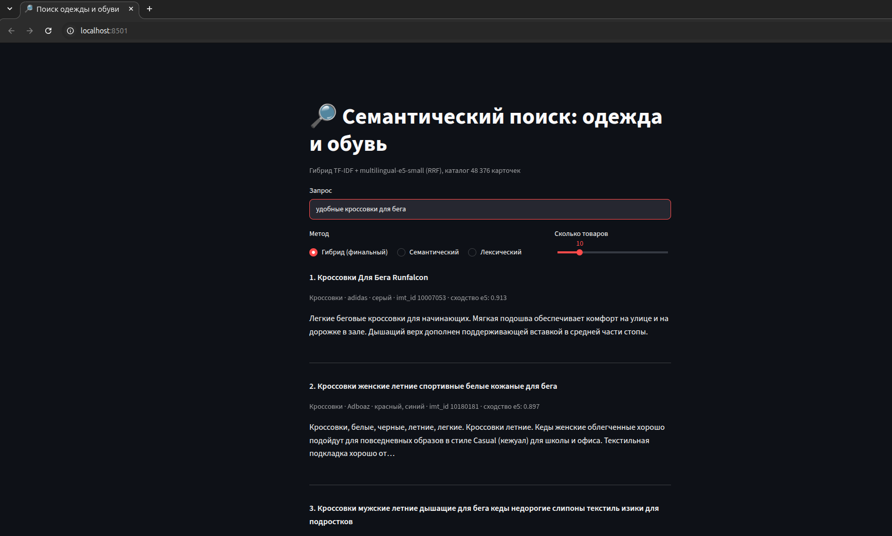

# Семантический поиск товаров (query-to-item)

MVP поисковой системы для каталога одежды и обуви CalmFruits: по короткому текстовому запросу система возвращает топ-K наиболее подходящих карточек товаров. Проект сравнивает лексический поиск (TF-IDF), семантический (эмбеддинги) и их гибрид на разметке релевантности и завершается рекомендацией бизнесу.

## Результаты

Каталог оценки — 4 256 карточек (пул асессоров), порог релевантности `relevance ≥ 2`, test — 300 запросов, не участвовавших в выборе конфигурации.

| Конфигурация | NDCG@10 | Recall@10 | MRR | Precision@5 | HitRate@10 |
|---|---|---|---|---|---|
| TF-IDF (baseline) | 0.490 | 0.511 | 0.359 | 0.138 | 0.600 |
| e5-small (baseline) | 0.583 | 0.795 | 0.686 | 0.261 | 0.900 |
| **Гибрид RRF + текст с метками (финальная)** | **0.601** | **0.830** | **0.693** | **0.271** | **0.917** |

**Финальная конфигурация:** Reciprocal Rank Fusion (k = 60, по 100 кандидатов, вес семантики 0.8) из TF-IDF и `intfloat/multilingual-e5-small`. Для эмбеддингов используется текст карточки с метками атрибутов: «Название. Категория: … Бренд: … Цвет: … Описание: …».

Подробности — эксперименты, анализ ошибок, ограничения оценки и рекомендации — в [`semantic_search_project.ipynb`](semantic_search_project.ipynb) и [`semantic_search_project_workbook.md`](semantic_search_project_workbook.md).

## Структура репозитория

```
├── semantic_search_project.ipynb        # EDA, пайплайн, эксперименты, MLflow, выводы
├── semantic_search_project_workbook.md  # рабочий документ проекта
├── app.py                               # Streamlit-приложение
├── download_data.py                     # загрузка исходных данных из S3
├── check_mlflow.py                      # проверка эксперимента в MLflow (из шаблона)
├── metrics_baseline.csv                 # метрики базового решения
├── requirements.txt                     # зависимости
├── .env.example                         # шаблон переменных окружения
└── docs/app_screenshot.png              # скриншот приложения
```

Данные (`data/`), модель (`models/`) и `.env` в репозиторий не входят — они создаются по инструкции ниже.

## Воспроизведение

Требуется Python 3.11. Все расчёты выполняются на CPU.

**1. Окружение**
```bash
git clone git@ds-practicum.gitlab.yandexcloud.net:s2004009/semantic-search.git
cd semantic-search
python3.11 -m venv .venv && source .venv/bin/activate
pip install -r requirements.txt
```
С [uv](https://docs.astral.sh/uv/):
```bash
uv venv --python 3.11 && source .venv/bin/activate
uv pip install -r requirements.txt --index-strategy unsafe-best-match
```
`requirements.txt` ставит CPU-сборку PyTorch (без CUDA).

**2. Доступы**
```bash
cp .env.example .env   # и заполните значения
```
| Переменные | Для чего |
|---|---|
| `S3_ENDPOINT`, `S3_BUCKET`, `S3_ACCESS_KEY`, `S3_SECRET_KEY` | загрузка исходных данных |
| `MLFLOW_TRACKING_URI`, `MLFLOW_TRACKING_USERNAME`, `MLFLOW_TRACKING_PASSWORD` | трекинг экспериментов |
| `AWS_ACCESS_KEY_ID`, `AWS_SECRET_ACCESS_KEY`, `MLFLOW_S3_ENDPOINT_URL` | загрузка артефактов MLflow в S3 |

**3. Данные**
```bash
python download_data.py   # 4 parquet-файла в data/
```

**4. Ноутбук.** Откройте `semantic_search_project.ipynb` с ядром `.venv` и выполните **Run All**. Первый прогон на CPU занимает около 1.5 часов, основное время уходит на эмбеддинги: e5-small по каталогу — ~17 мин, bge-m3 — ~35 мин, финальные эмбеддинги для приложения — ~20 мин. Эмбеддинги кешируются в `data/*.npy`, поэтому повторный прогон занимает несколько минут. Все случайные операции используют `SEED = 42`.

В результате в `data/` и `models/` появляются артефакты для приложения, а в MLflow — эксперимент `wb-semantic-search`. Проверка эксперимента:
```bash
python check_mlflow.py wb-semantic-search --env-file .env
```

## Streamlit-приложение

Приложение ищет по всему каталогу домена (48 376 карточек одежды и обуви) финальной конфигурацией. Можно переключиться на чистый семантический или лексический поиск и сравнить выдачу. Для каждого товара показаны название, категория, бренд, цвет, `imt_id`, косинусное сходство e5 и фрагмент описания.

**Запуск:**
```bash
streamlit run app.py
```
Приложение откроется на http://localhost:8501.

**Нужные артефакты** создаются ячейкой сохранения в разделе «Финальный тест» ноутбука:

| Файл | Содержимое |
|---|---|
| `models/e5-small/` | модель `intfloat/multilingual-e5-small` |
| `data/catalog_app.parquet` | каталог: `product_text` для TF-IDF, `search_text` для эмбеддингов и поля для показа |
| `data/emb_app.npy` | эмбеддинги `search_text` (48 376 × 384), в том же порядке строк, что и каталог |

Модель, эмбеддинги и TF-IDF-индекс загружаются один раз при старте и кешируются (`st.cache_resource`, `st.cache_data`). Для каждого запроса считается только его эмбеддинг.


